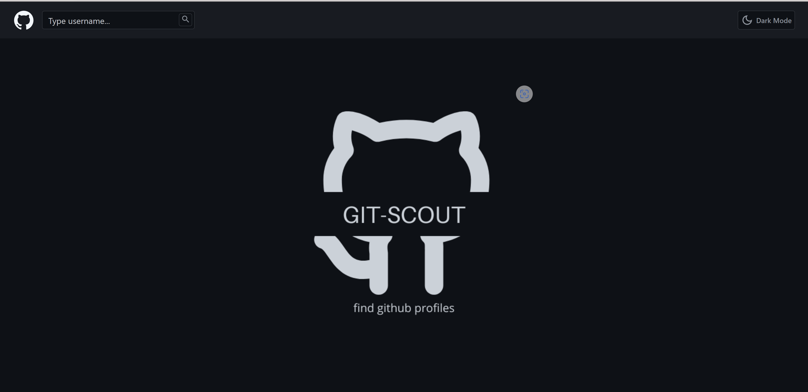
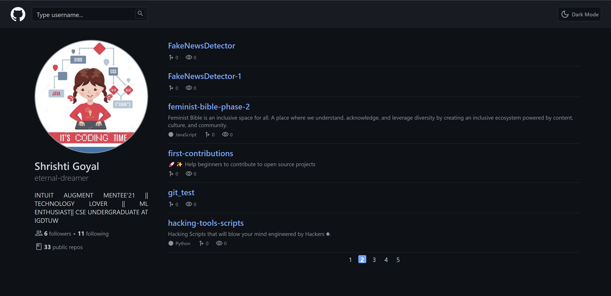
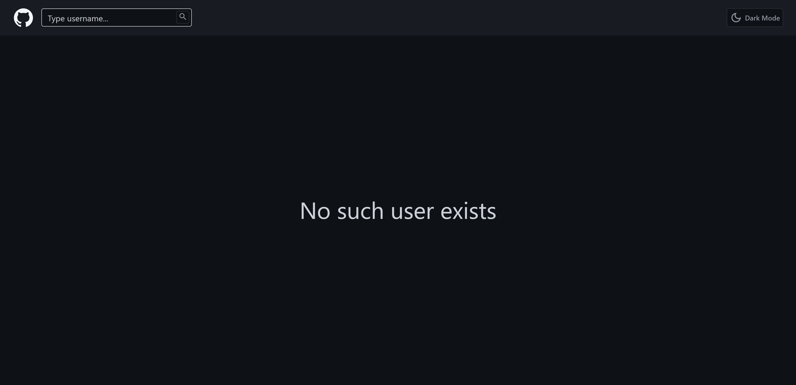
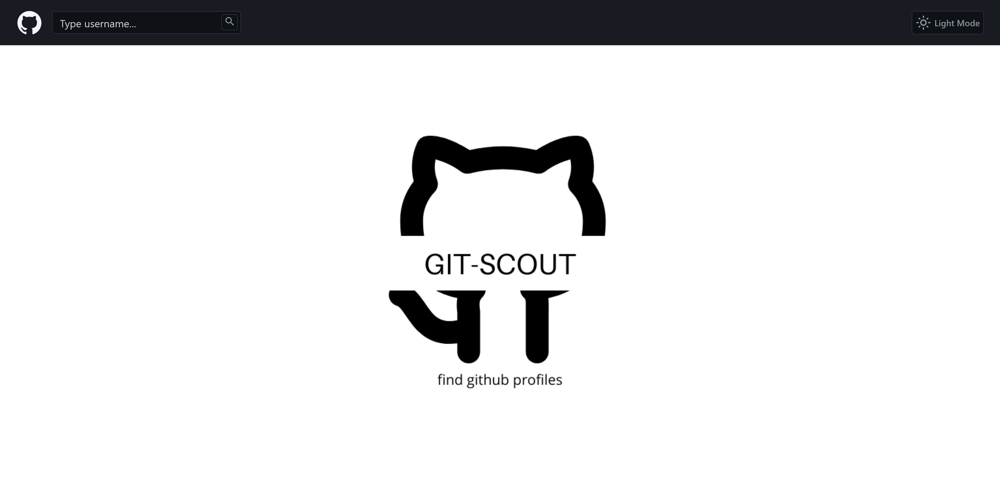
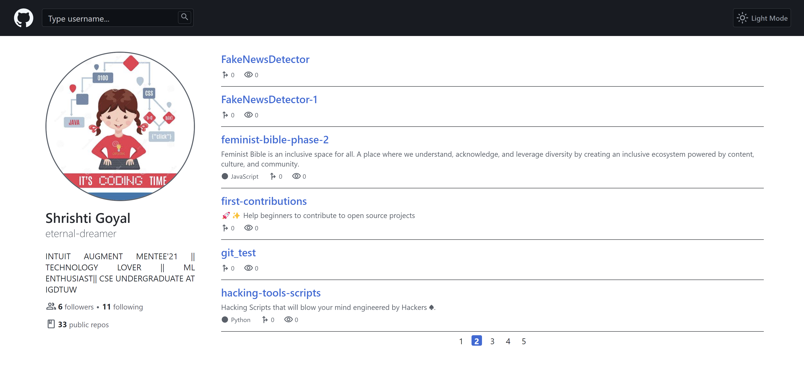

### How to Use

Clone this repository

```shell
git clone https://github.com/Deep062001/preImgAssign.git
```

Move to the repository's root folder

```shell
cd preImgAssign
```

##### For running the react app

Get to the root folder and type this:

```shell
npm install
npm start
```

### About

Currently only Desktop view is available
#### Dark Mode




#### Light Mode




### Links
[Video Link](https://drive.google.com/file/d/1IYoOCZO1-nxnmZU8lLA4NItu56xlTLpn/view?usp=sharing)
[Project Link](https://github-scout-gs.netlify.app/)
